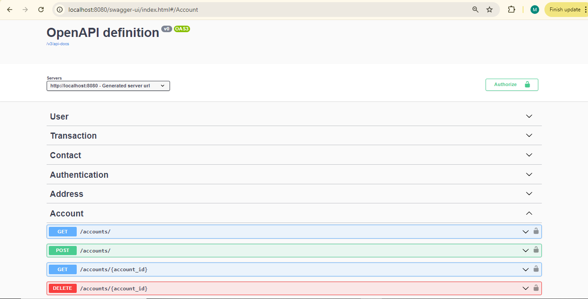
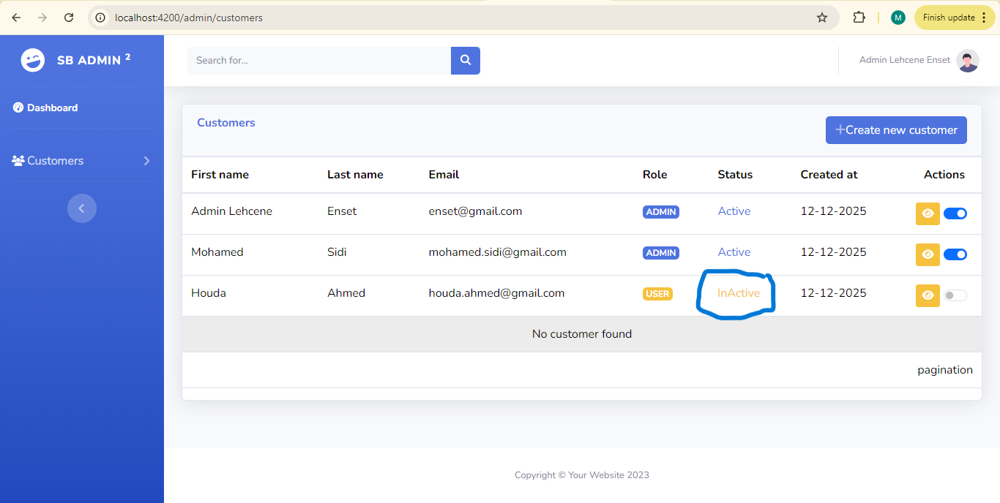
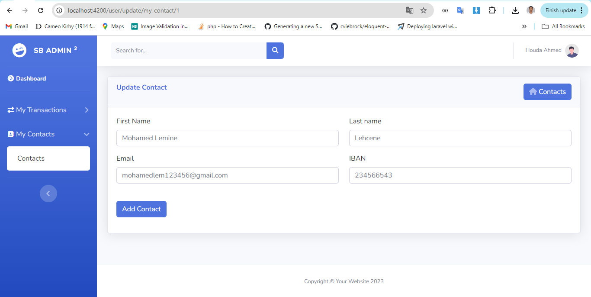
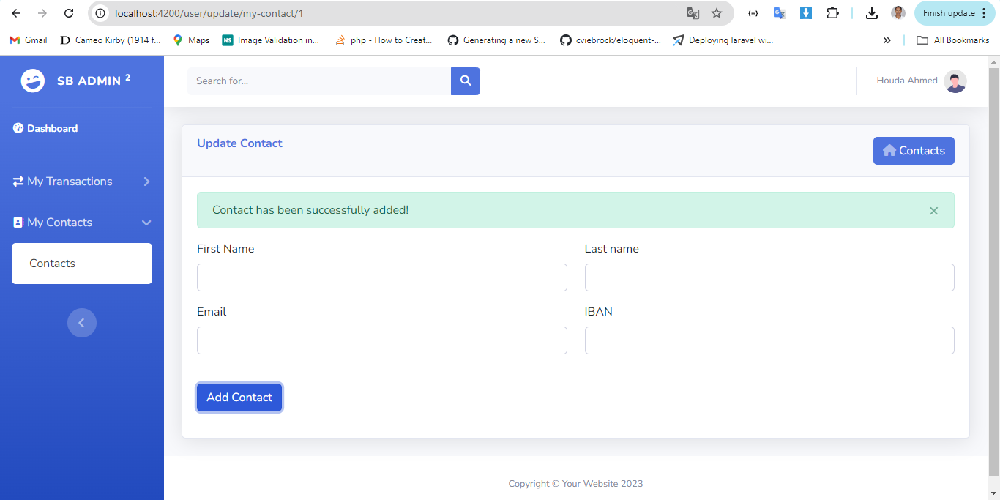
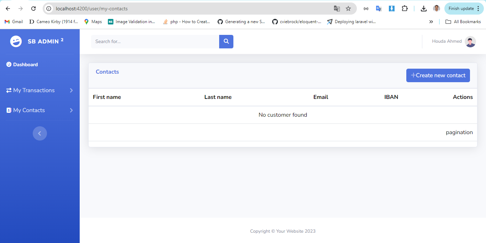

# Application de Gestion Bancaire

## Description
Cette application de gestion bancaire est construite avec **Spring Boot** pour le backend et **Angular** pour le frontend. Elle permet de gérer des utilisateurs, des comptes, des transactions, et des contacts, tout en offrant des fonctionnalités d'authentification et d'autorisation.

## Table des Matières
- [Fonctionnalités](#fonctionnalités)
- [Technologies Utilisées](#technologies-utilisées)
- [Installation](#installation)
- [Configuration](#configuration)
- [Utilisation](#utilisation)
- [Documentation API](#documentation-api)
- [Exemples d'Interfaces](#exemples-dinterfaces)
- [Contributeurs](#contributeurs)
- [License](#license)

## Fonctionnalités
- Inscription et connexion des utilisateurs
- Gestion des rôles (Administrateur, Utilisateur)
- Création, modification et suppression de contacts
- Gestion des transactions (dépôts, retraits)
- Interface utilisateur réactive
- Sécurité avec JWT

## Technologies Utilisées
- **Backend**: Spring Boot, Java
- **Frontend**: Angular, TypeScript, HTML, CSS
- **Base de données**: PostgreSQL
- **Documentation API**: Swagger

## Installation
1. Clonez le repository:
   ```bash
   git clone https://github.com/username/nom-du-repo.git
   ```
2. Naviguez dans le dossier du projet :
   ```bash
   cd nom-du-repo
   ```

3. Installez les dépendances pour l'application Spring Boot :
   ```bash
   ./mvnw install
   ```

4. Installez les dépendances pour l'application Angular :
   ```bash
   cd frontend
   npm install
   ```

## Configuration
1. **Configurer la base de données PostgreSQL :**
  - Modifiez les propriétés dans le fichier `application.properties` ou `application.yml` pour indiquer les bonnes informations de connexion à votre base de données.

   ```properties
   spring.datasource.url=jdbc:postgresql://localhost:5432/votre-base-de-donnees
   spring.datasource.username=votre-utilisateur
   spring.datasource.password=votre-mot-de-passe
   ```

2. **Configurer JWT :**
  - Définissez les clés secrètes pour JWT dans votre fichier de configuration.

## Utilisation
1. **Démarrer le backend :**
   ```bash
   ./mvnw spring-boot:run
   ```

2. **Démarrer le frontend :**
   ```bash
   cd frontend
   ng serve
   ```

## Documentation API
La documentation Swagger de notre API :
  
  
  
  
  
  
  


## Exemples d'Interfaces

### 1. Diagramme de Classe
Voici le diagramme de classe après l'implémentation de toutes les entités :


### 2. Interface de Connexion et d'Inscription
Voici l'interface de connexion et d'inscription :
  


### 3. Service CommandLineRunner
J'ai implémenté un service **CommandLineRunner** qui permet de créer un utilisateur au démarrage de l'application avec le rôle : **ROLE_ADMIN**.


## Tester notre Application

### 5.1 Authentification avec l'administrateur
- **Essayer de se connecter avec l'utilisateur créé par notre service au démarrage de l'application. Un message indique que cet utilisateur ne peut pas se connecter car son compte n'est pas encore actif.**
  
  

- **Activation du compte utilisateur depuis notre base de données PostgreSQL**
  

- **Connexion de l'utilisateur administrateur**
  
  

### 5.2 Créer un utilisateur avec rôle ADMIN & Activer son compte
- **Commencer par la création de l'utilisateur, remplir ses informations et lui affecter le rôle ADMIN comme montré ci-dessous**
  
  
  
  
  

- **Activer son compte en cliquant sur le bouton checkbox radio**
  

### 5.3 Création de compte par l'utilisateur via la page d'inscription
- **Création du compte pour l'utilisateur depuis la page d'inscription**
  
- **Message confirmant que la création du compte a été reçue. L'administrateur doit d'abord valider et activer son compte.**
  
- **Liste des utilisateurs, incluant celui créé à partir de la page d'inscription**
  

### 5.4 Tentative de connexion avec l'utilisateur
- **Saisir les informations de l'utilisateur**
  
- **Message indiquant que cet utilisateur ne peut pas accéder car son compte n'est pas encore actif.**
  
- **Confirmation que son compte n'est pas encore actif.**
  
- **Activation du compte utilisateur par l'administrateur**
  
- **Connexion de l'utilisateur après l'activation de son compte par l'administrateur**
  
  

### 5.5 Gestion des Transactions
- **Liste des transactions**
  
- **Création d'une transaction de type DÉPÔT**
  
  
- **Message confirmant que la transaction a bien été reçue**
  
- **Liste des transactions mises à jour**
  

### 5.6 Gestion des Contacts
- **Liste des contacts**
  
- **Création d'un contact**
  
- **Message confirmant que le contact a bien été reçu**
  
- **Liste des contacts mise à jour**
  
- **Modification d'un contact par ID**
  
  
  
  
  
- **Suppression d'un contact par ID**
  
  
  

### 5.7 Déconnexion
- **Déconnexion de l'utilisateur**
  
- **Confirmation de la déconnexion**
  
  

## Sécurité avec les Gardes
- **La sécurité est gérée via des gardes pour assurer une protection adéquate des ressources de l'application.**

## Contributeurs
- [Votre Nom](https://github.com/votrecompte)
- [Collaborateurs](https://github.com/)

## License
Ce projet est sous licence MIT. Consultez le fichier [LICENSE](LICENSE) pour plus de détails.

---

Merci pour votre attention et votre soutien !
